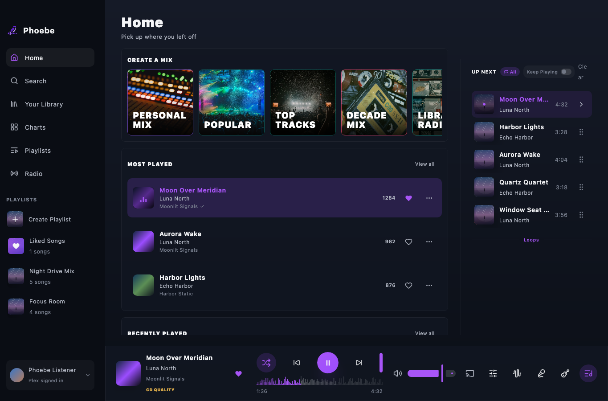
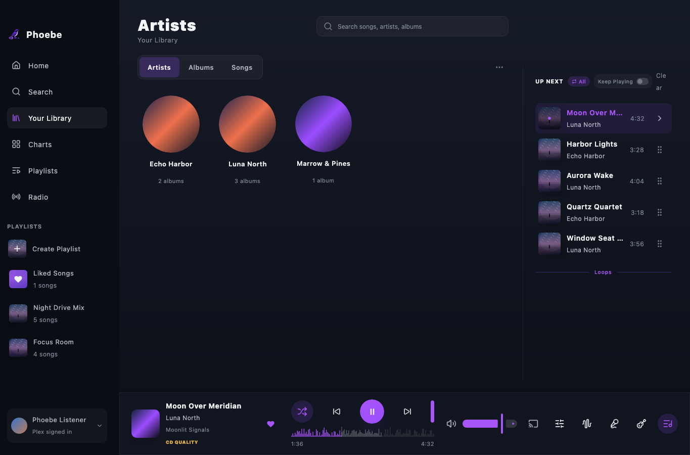
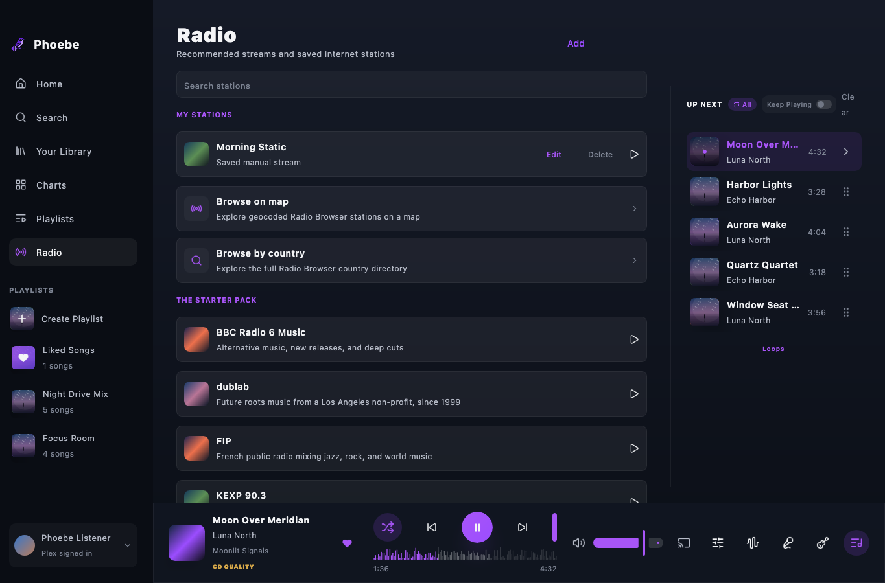
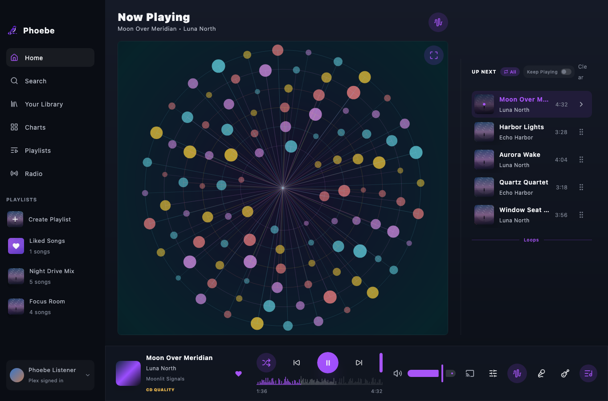
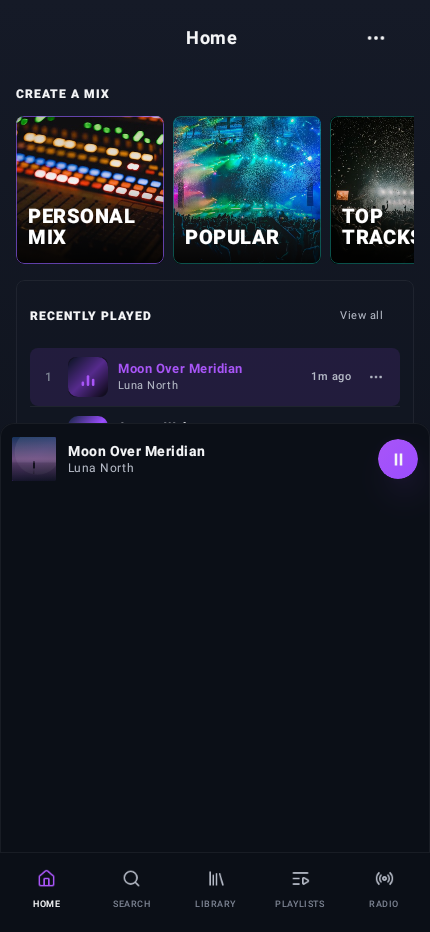
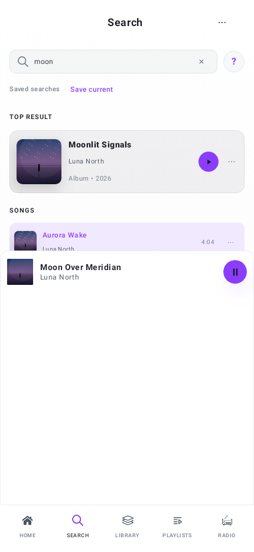
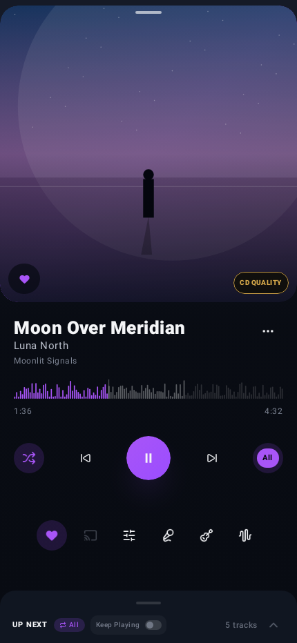
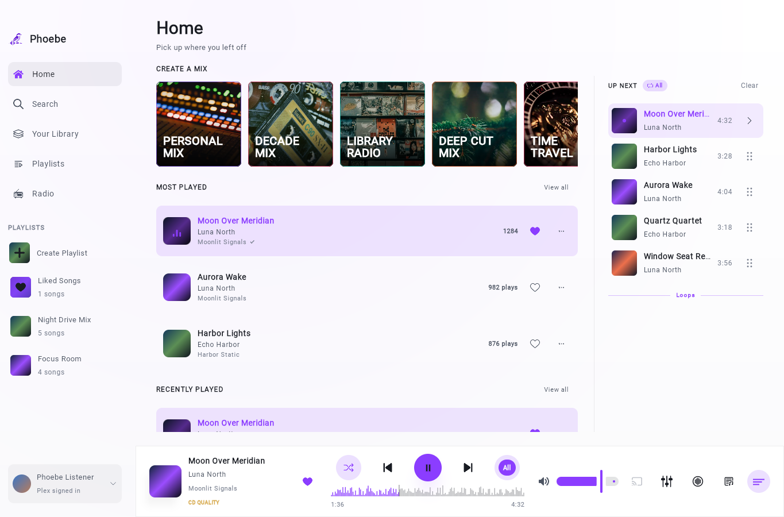
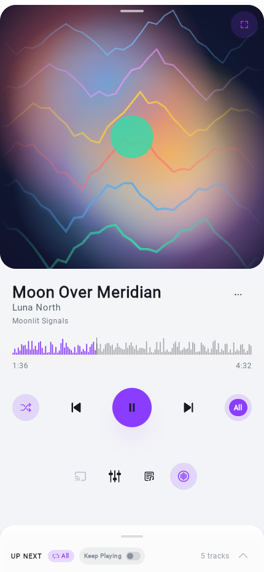

# Phoebe

<p align="center">
  
</p>

Phoebe is a Compose Multiplatform music player for Plex, Jellyfin, Emby, Subsonic-compatible servers (Navidrome, etc.), Music Assistant, local folders, Android, iOS, desktop (JVM), and the browser (Kotlin/Wasm).

Try the web build at [music.joetr.com](https://music.joetr.com), or grab native installers and mobile binaries from [GitHub Releases](https://github.com/j-roskopf/Phoebe/releases).

## Music providers

Phoebe can sign in to one remote music source at a time (plus optional local folders). Catalog IDs are prefixed (`plex:`, `jellyfin:`, `emby:`, `navidrome:`, `music-assistant:`) so items from different backends can be merged with local files in search and the library.

**Support policy:** Plex is the primary, best-tested integration. Jellyfin, Emby, Subsonic (Navidrome), and Music Assistant support also work, but are not my main hosting providers, so they get tested less frequently. 

### Capability overview

| Capability | Plex | Jellyfin | Emby | Subsonic (Navidrome) | Music Assistant | Local folders |
|------------|:----:|:--------:|:----:|:--------------------:|:---------------:|:-------------:|
| Sign-in | PIN | Password + Quick Connect | Password | Username/password (token) | API token | Folder picker |
| Server discovery | Yes | No (URL) | No (URL) | No (URL) | No (URL) | — |
| Artists / albums / playlists / tracks | Yes | Yes | Yes | Yes | Yes | Yes |
| Lazy / paged catalog sync | Yes | Quick + full | Quick + full | Quick + full | Yes | Index on add |
| Create / edit playlists | Yes | Yes | Yes | Yes | Yes | Phoebe-only |
| Track hearts / stars | Liked Songs playlist | Server favorite | Server favorite | Star | Favorite | Local only |
| Artist / album favorites | Plex collections | Server API | Server API | Star | Favorite | Local only |
| Star ratings | Yes | Yes | Yes | Yes | No | Local tags |
| Metadata editing (server sync) | Yes | Yes | Yes | No | No | Tags / sidecar |
| Native in-app streaming | Yes | Yes | Yes | Yes | Partial¹ | Yes |
| Offline downloads | Yes | Yes | Yes | Yes | When URL available | From disk |
| Playback sync to server | Timeline API | Session progress | Session progress | Scrobble on stop | Queue control | — |
| Home library radio stations | Yes | No | No | No | Via MA² | — |
| Artist radio / mix | Plex stations | Instant mix | Instant mix³ | Not wired⁴ | Via MA² | — |
| Internet radio streams | Yes | Yes | Yes | Yes | Yes | Yes |
| Collections (genre / mood / style) | All three | Genre | Genre | Genre | Genre | From tags |
| Import server play history | Yes | Yes | Yes | Yes | No | — |
| Chromecast | Yes | Yes | Yes | Yes | When stream URL is receiver-loadable | Remote HTTP(S) streams |

¹ Music Assistant items are modeled as **Library + Control**: Phoebe can browse the MA library and often delegates playback to Music Assistant’s default player queue. Direct stream URLs are used when the server exposes them; many upstream provider tracks are not guaranteed to play inside Phoebe alone.

² Music Assistant “radio” and mixes are whatever the MA server exposes through its library/queue APIs, not Plex-style named stations inside Phoebe.

³ Jellyfin and Emby both expose instant-mix APIs; artist radio in the UI is wired for Jellyfin today.

⁴ Navidrome/Subsonic `getSimilarSongs2` exists in the client but is not yet hooked up to Artist Radio in the app.

### Plex (primary)

Full-featured integration: PIN sign-in, relay/shared server discovery, music-library selection, lazy track loading, playlists (including Liked Songs), favorite artist/album Plex collections, ratings, metadata edits, original-file downloads, playback timeline reporting, Plex library radio stations and artist radio, genre/mood/style collections, and optional playback-history import to warm the catalog.

### Jellyfin & Emby (Jellyfin API family)

Shared catalog and playback stack (Emby uses `/emby` path normalization). Password sign-in on the server URL; Jellyfin also supports **Quick Connect**. Music libraries, artists, albums, playlists, and tracks sync with optional quick (paged) or full catalog modes. Playlists can be created and edited; favorites and ratings sync to the server; Jellyfin/Emby track metadata can be edited from Phoebe. Streams and downloads use the server’s item URLs; playback position is reported to the session API. Server playback history can be imported to warm play counts and recently played panels. **Artist instant mix** works for Jellyfin; Emby uses the same server APIs but artist-radio UI entry points are not fully aligned yet. Genre-only collections (no Plex mood/style facets). No PIN flow, no Plex-style home radio stations, and no Plex Liked Songs playlist semantics (hearts map to server favorites).

### Subsonic — Navidrome and compatible servers

Subsonic-compatible `/rest/*.view` JSON with token auth (`u`, `t`, `s`, `v=1.16.1`, `c=phoebe`, `f=json`). Music folders, artists, albums, songs, playlists, playlist create/add, stars, ratings, streaming, downloads, artwork, and scrobbling on track stop. Quick and paged full-catalog sync modes. Server play-history stats can be imported when Navidrome exposes them. Genre collections only. No server metadata editing, no Plex-style library radio, and artist radio is not exposed in the UI yet (depends on server Last.fm/similar-song configuration when enabled).

### Music Assistant

Bearer-token JSON API (`/api`). Library browse, search, playlists, playlist edits, and favorites. Ratings are not supported. Playback is **library + control**: queue commands target Music Assistant’s player; local streaming is attempted when MA returns a playable URL. Treat MA as an orchestration hub, not a guarantee that every linked Spotify/Tidal/etc. item will stream directly inside Phoebe.

### Local folders

Desktop, Android, iOS, and web folder roots. Web uses the browser file picker and can index/play picked files for the current page session. Indexed tracks merge with whichever remote provider is signed in. Phoebe-only playlists, exports (M3U8, text, CSV on desktop), and tag-based metadata. Can be used without any remote sign-in.

## Features

For UI architecture and navigation rules, see [Compose Architecture Guidelines](docs/compose-architecture.md).

### Library and catalog

- **Remote providers** — See [Music providers](#music-providers) for per-backend capabilities; sign in from the welcome screen (Plex PIN or direct URL for the others).
- **Lazy library loading** — Track lists load on demand for albums, artists, and playlists; opened detail views are preserved across catalog refreshes. Optional **scan library on launch** refreshes the catalog at startup.
- **Local music folders** — Add one or more local folder roots (desktop, Android, iOS, and web), enable or disable them individually, and merge them with a remote catalog in one library. You can add a folder from the sign-in screen to use Phoebe without signing in to a server.
- **Unified catalog** — Remote provider prefixes and local tracks appear together in search, library views, and playback.
- **Home** — Configurable sections (mixes, collections, favorite playlists/artists/albums, recents, listening history, random picks) with order controlled in Settings. Recently added songs, artists, and albums (7-day window), **heavy rotation** (frequently replayed tracks in a 14-day window), recently played and most-played panels, random artist/album picks, a **personal mix** seeded from listening history (weights tunable in Settings), and a **decade mix** for a chosen era. Plex library radio stations appear in mixes when signed in to Plex. Mobile home can use **Compact** or **Expanded** layout modes.
- **Internet radio** — Browse recommended stations, search the Radio Browser directory, jump through country/category groups with the same section index used by Library, and save custom stream URLs as manual stations.
- **Collections** — Browse artists and albums grouped by **genre**, **mood**, or **style** where the active source exposes them (Plex and local tags: all three; other providers: genre only).
- **Play history** — Dedicated screens for recently played and most played tracks; per-play events power smarter home mixes. Last-played timestamps and play counts surface in the library and home UI. Plex, Jellyfin/Emby, and Navidrome playback history can be imported from the server to warm play counts and missing track metadata.
- **Rich library table** — Configurable columns (title, artist, album, year, genre, path, codec, bitrate, duration, rating, favorite, and related fields where available).
- **Sorting and layout prefs** — Sort library and detail views; column visibility and sort preferences persist per platform. Album and artist grid tile sizes are adjustable in Settings.
- **Favorite screens** — Full-screen views for favorite playlists, artists, and albums (reachable from Home or navigation).

### Playlists, likes, favorites, and ratings

- **Playlists** — Create and edit playlists on Plex, Jellyfin, Emby, Subsonic, and Music Assistant when signed in; drag a song onto a sidebar playlist row on desktop. **Local playlists** are Phoebe-only (export to **M3U8**, plain text, or **CSV** under `exports/` on desktop).
- **Liked Songs / hearts** — Plex: syncs with Plex’s Liked Songs playlist. Other providers: hearts map to server favorites/stars (see capability table).
- **Favorites** — Artists, albums, and playlists; Plex also syncs favorite artist/album collections. Favorite playlist flags can be exported/imported as JSON on desktop (`exports/favorite-playlists.json`).
- **Star ratings** — Half-star ratings on tracks, artists, albums, and playlists; synced to the active server when supported (not on Music Assistant).

### Playback and player

- **Playback** — Play, pause, seek, next/previous, shuffle, repeat, and an Up Next queue you can add to, reorder, and play from. Optional **crossfade** (0–12 seconds) on local playback paths.
- **Now playing** — Full-screen player with artwork, waveform seek bar, transport controls, queue, audio-quality badges (FLAC/ALAC/MP3/hi-res labels from codec and bitrate), and a now-playing badge on the active track row. Optional **audio-reactive visualizers** (Alchemy, Battery, Bars & Waves, Blazing Colors, Plenoptic) or plain artwork; blurred-artwork backdrop can be toggled in Appearance.
- **Graphic equalizer** — 5-, 10-, 15-, and 31-band EQ with ±12 dB gain, a draggable response curve, per-band sliders, reset, enable/disable, and optional persistence across app restarts. EQ is wired into local playback on Android, desktop, iOS, and web; remote paths such as Chromecast keep using their own audio pipeline.
- **Lyrics** — Synced and plain lyrics from embedded tags, sidecar files, and [LRCLIB](https://lrclib.net); cached in SQLDelight with auto-scroll during playback (desktop lyrics section and mobile detail flow).
- **Playback sync** — Plex timeline reporting; Jellyfin/Emby session progress; Subsonic scrobble on stop (see [Music providers](#music-providers)).
- **ListenBrainz** — Optional separate scrobbling account (user token stored in the platform secure credential store). Submit now-playing and completed listens, plus love/hate feedback from the player when enabled.
- **Search** — Search songs, artists, and albums across the merged catalog, with recent search history.

### Downloads and metadata

- **Downloads** — Download remote tracks when the server exposes a URL (Plex original files, Jellyfin/Emby/Subsonic download endpoints); pick a download directory where supported. Optional notification when a download finishes (Android).
- **Metadata editing** — Edit title, artist, album, year, and genre; changes persist locally and sync to Plex, Jellyfin, or Emby when supported.

### Appearance and settings

- **Appearance** — Album-art-inspired Material 3 UI with light and dark modes, ten accent-color tints, now-playing visualizer preset, and blurred-artwork backdrop toggle (preferences stored in app storage).
- **Settings** — Desktop category shell (Account, Personalization, Audio Playback, Library, Downloads, Appearance, Notifications, About, Advanced). Manage provider and ListenBrainz sign-in, crossfade, scan-library-on-launch, EQ/volume persistence, local folders, home section order and personal-mix weights, grid sizes, favorite-playlist export/import, downloads, notifications, and appearance.

### System integration

- **Volume** — OS system volume where supported; optional volume persistence across restarts. On Linux Flatpak, volume can be adjusted via host `pactl` when sandboxed.
- **Global media keys** — Desktop play/pause/next/previous (Space toggles play/pause when no text field is focused), media-key shortcuts, and a macOS native bridge for hardware media keys.
- **Android playback service** — Media3 foreground `PlaybackService` with notification and lock-screen transport controls.
- **Chromecast** — Google Cast queue and transport when a Cast device is connected. Android/iOS use the Google Cast SDK; desktop uses a native JVM CastV2 sender and requires local-network/mDNS access. Desktop and web cast remote HTTP(S) streams only; unsupported Plex codecs (for example FLAC) use Plex’s universal MP3 transcode URL where available. Local playback pauses only after the Cast load succeeds.
- **Android Auto** — Media browse tree over the cached catalog for in-car browsing.
- **CarPlay (iOS)** — Browse and play from the CarPlay template (requires the CarPlay audio entitlement on your App ID for distribution signing).
- **Window chrome** — macOS unified title bar (full-window content, transparent title bar); Windows caption/border colors and immersive dark mode matched to the app theme via DWM.
- **Artwork cache** — LRU-bounded remote artwork cache with decode-size keys; desktop decodes downscaled bitmaps via Skia to limit memory use.

### Multiplatform and data

- **Multiplatform** — Android, iOS, desktop (JVM), and browser (Kotlin/Wasm) targets from a shared Compose UI and data layer. The web build supports URL routes (`/search`, `/library`, `/artist/…`, `/album/…`, `/player`, and related paths) for deep linking.
- **Offline-friendly persistence** — SQLDelight-backed catalog, session, media sources, library preferences, downloads state, play history, and lyrics cached across restarts.

## Platforms

| Platform | Get Phoebe | Local folders | Cast | Notes |
|----------|------------|---------------|------|--------|
| **Web (Wasm)** | [Open music.joetr.com](https://music.joetr.com) | Yes (browser picker, current session) | — | Browser build deployed from release CI; Plex streaming, local picked-file playback, HTML audio playback, SQLDelight Web Worker DB, and WebAudio EQ when the source permits access. |
| **Arch Linux** | [GitHub Releases](https://github.com/j-roskopf/Phoebe/releases) (`.flatpak`) | Yes (folder picker) | Chromecast | Use the Flatpak bundle on Arch and other non-Debian distributions; Cast requires local-network/mDNS access. |
| **Debian / Ubuntu** | [GitHub Releases](https://github.com/j-roskopf/Phoebe/releases) (`.deb`) | Yes (folder picker) | Chromecast | Native JVM desktop package with tuned heap and Skiko GPU cache settings; Cast supports remote HTTP(S) streams. |
| **Other Linux** | [GitHub Releases](https://github.com/j-roskopf/Phoebe/releases) (`.flatpak`) | Yes (folder picker) | Chromecast | Flatpak bundle is built alongside the DEB package; Cast requires local-network/mDNS access. |
| **Windows** | [GitHub Releases](https://github.com/j-roskopf/Phoebe/releases) (`.msi`) | Yes (folder picker) | Chromecast | Signed MSI release; window caption/border colors follow the app theme; Cast supports remote HTTP(S) streams. |
| **macOS** | [GitHub Releases](https://github.com/j-roskopf/Phoebe/releases) (`.dmg`) | Yes (folder picker) | Chromecast | Signed and notarized DMG; native bridge handles hardware media keys; Cast supports remote HTTP(S) streams. |
| **Android** | [GitHub Releases](https://github.com/j-roskopf/Phoebe/releases) (`.apk`, `.aab`) | Yes (SAF tree URI) | Chromecast | Android Auto browse, Media3 playback, Cast queue/transport, and instrumented playback tests on CI. |
| **iOS** | [GitHub Releases](https://github.com/j-roskopf/Phoebe/releases) | Yes (native folder picker) | Chromecast (manual SDK setup) | iOS app target with AVPlayer playback, Google Cast sender support, and CarPlay browse/play in code; release CI uploads an unsigned IPA for sideloading/local signing. |


## Verify

```bash
./gradlew :composeApp:desktopTest
./gradlew :composeApp:wasmJsBrowserTest
./gradlew :composeApp:verifyRoborazziAndroidHostTest
./gradlew :composeApp:verifyRoborazziDesktop
npm run web:screenshots
./gradlew :composeApp:compileAndroidDeviceTestSources
./gradlew :androidApp:assembleDebug
./gradlew :composeApp:compileKotlinIosSimulatorArm64
```

PR CI runs desktop tests, Wasm tests, Roborazzi screenshot verification, Playwright web screenshots, and Android instrumented tests. See [docs/github-actions.md](docs/github-actions.md) for updating baselines and release workflow details.

## Run

**Desktop (default JVM “desktop” target):**

```bash
./gradlew :composeApp:run
```

**Web — development server (Webpack):**

```bash
./gradlew :composeApp:wasmJsBrowserDevelopmentRun
```

**Android debug APK:**

```bash
./gradlew :androidApp:assembleDebug
```

The Android SDK path is set in `local.properties` for this machine and ignored by git.

### Google Maps key for local development

The radio map works without a checked-in Google Maps key. For local development, supply your own key in ignored local configuration:

```properties
# local.properties
phoebe.googleMaps.apiKey=your-google-maps-api-key
```

Use platform-specific keys when you need different API restrictions:

```properties
phoebe.googleMaps.androidApiKey=your-android-key
phoebe.googleMaps.iosApiKey=your-ios-key
phoebe.googleMaps.desktopApiKey=your-desktop-key
phoebe.googleMaps.webApiKey=your-web-key
```

The desktop map serves its embedded browser from `127.0.0.1:41473` when that port is available. In Google Cloud Console, set the desktop key's application restriction to **Websites** / HTTP referrers, not **IP addresses**, then allow `127.0.0.1:41473/*` and enable the Maps JavaScript API for that key. IP address restrictions only accept CIDR addresses and cannot include the port or path used by the desktop map. If another process already has port `41473`, Phoebe falls back to a random free port; close the other process and restart Phoebe to use the restricted desktop key.

You can also pass keys with environment variables for a single shell session:

```bash
export PHOEBE_GOOGLE_MAPS_API_KEY=your-google-maps-api-key
export PHOEBE_GOOGLE_MAPS_ANDROID_API_KEY=your-android-key
export PHOEBE_GOOGLE_MAPS_IOS_API_KEY=your-ios-key
export PHOEBE_GOOGLE_MAPS_DESKTOP_API_KEY=your-desktop-key
export PHOEBE_GOOGLE_MAPS_WEB_API_KEY=your-web-key
```

Platform-specific keys take precedence over the shared `phoebe.googleMaps.apiKey` / `PHOEBE_GOOGLE_MAPS_API_KEY` fallback. Desktop environment variables are checked before build-time keys so you can override a packaged/local key for one run. Keep these values out of git; release keys are configured separately as GitHub secrets in [docs/github-actions.md](docs/github-actions.md).

### Phoebe backend

Artist event search and Genius annotation enrichment are served by the Ktor backend in `:backend:app`. Feature routes live in `:backend:events` and `:backend:lyrics`, and deployment discovers backend modules from the `backend/` directory. Release builds call the production backend URL from `PHOEBE_BACKEND_URL` / `phoebe.backend.url`; debug builds can switch between production and localhost from the hidden debug menu. The old `PHOEBE_EVENTS_BACKEND_URL` / `phoebe.events.backendUrl` names still work as fallbacks.

Run it locally on port `8088`:

```bash
export TICKETMASTER_API_KEY=your-ticketmaster-consumer-key
export SEATGEEK_CLIENT_ID=your-seatgeek-client-id
export GENIUS_ACCESS_TOKEN=your-genius-client-access-token
./gradlew :backend:app:run
```

Or put local-only backend secrets in `~/.gradle/gradle.properties`; the `:backend:app:run` task passes them to the Ktor process:

```properties
TICKETMASTER_API_KEY=your-ticketmaster-consumer-key
SEATGEEK_CLIENT_ID=your-seatgeek-client-id
GENIUS_ACCESS_TOKEN=your-genius-client-access-token
```

The VS Code and Codex `Phoebe Backend` run configs also load optional local secrets from `.env.backend.local`; `.env.events.local` still works as a fallback:

```bash
TICKETMASTER_API_KEY=your-ticketmaster-consumer-key
SEATGEEK_CLIENT_ID=your-seatgeek-client-id
GENIUS_ACCESS_TOKEN=your-genius-client-access-token
```

Check it:

```bash
curl http://127.0.0.1:8088/health
curl "http://127.0.0.1:8088/v1/artist-events?provider=ticketmaster&artist=Taylor%20Swift&limit=1"
curl "http://127.0.0.1:8088/v1/genius/referents?artist=Taylor%20Swift&title=Anti-Hero"
```

For Vercel, create/link the project from the repository root because the deployment uses `Dockerfile.vercel`:

```bash
npm install --global vercel
vercel login
vercel project add phoebe-backend # first time only; skip if the project already exists
vercel link --yes --project phoebe-backend
```

If the backend lives in another Vercel team or account, add `--scope <team-slug-or-username>` to the `project add` and `link` commands.

In the Vercel project, add these Production environment variables:

- `TICKETMASTER_API_KEY`
- `SEATGEEK_CLIENT_ID`
- `GENIUS_ACCESS_TOKEN`: Genius client access token used only by the backend
- `ALLOWED_ORIGINS`, optional comma-separated allowed origins
- `BACKEND_CACHE_TTL_MINUTES`, optional cache TTL override, default `240`; `EVENTS_CACHE_TTL_MINUTES` still works as a fallback

Deploy manually using the backend-only context script, or use the VS Code/Codex `Publish Phoebe Backend` action:

```bash
scripts/deploy-phoebe-backend-vercel.sh --prod --yes
```

Use the script from this repository. It creates a temporary Vercel context containing the backend modules, `:domain`, Gradle metadata, and build logic, then deploys that directory with archive upload enabled. Plain `vercel deploy --prod` from the repo root can upload the wrong context, deploy no container, or fail with `Request body too large. Limit: 10mb`.

After deploy, copy the production URL into local app builds:

```properties
# local.properties
phoebe.backend.url=https://your-backend.vercel.app
```

For release CI, add these GitHub Actions repository secrets:

- `PHOEBE_BACKEND_URL`: the Vercel production backend URL
- `VERCEL_TOKEN`: Vercel access token
- `VERCEL_ORG_ID`: from `.vercel/project.json`
- `VERCEL_PROJECT_ID_PHOEBE_BACKEND_PROD`: from `.vercel/project.json`

The release workflow runs on every push to `main`, so merging to `main` triggers a release. Its `phoebe-backend` job deploys the production backend with `scripts/deploy-phoebe-backend-vercel.sh --prod --yes`, checks `/health`, and runs a Ticketmaster smoke lookup in parallel with the client packaging jobs. The GitHub release and final web Pages deploy still wait for the backend smoke test to pass. Legacy `PHOEBE_EVENTS_BACKEND_URL`, `phoebe.events.backendUrl`, and `VERCEL_PROJECT_ID_EVENTS_PROD` still work as fallback names.

**iOS debug build:**

```bash
scripts/install-ios-google-cast-sdk.sh
xcodebuild -project iosApp/iosApp.xcodeproj -scheme iosApp -configuration Debug -sdk iphonesimulator -destination 'generic/platform=iOS Simulator' build
```

## Releases

Every push to `main` runs the release workflow. It bumps `gradle.properties`, tags `release/x.y.z`, then deploys the Phoebe backend to Vercel in parallel with signed Android APK/AAB, Linux DEB and Flatpak, Windows MSI, macOS DMG, web, and iOS artifact generation. Signing secrets and setup are documented in [docs/github-actions.md](docs/github-actions.md) and `docs/release-signing-setup.md`.

## Debug logging

Verbose diagnostics use a shared `PhoebeLog` helper (`composeApp/src/commonMain/kotlin/com/phoebe/app/platform/PhoebeLog.kt`). All log calls are no-ops in release builds.

```kotlin
PhoebeLog.d("MyComponent") { "lifecycle or error detail" }
PhoebeLog.v("MyComponent") { "high-volume trace" }
```

Lazy message lambdas avoid string work when logging is disabled.

| Platform | Enabled when |
|----------|----------------|
| **Android** | App debuggable flag (debug APK / `:androidApp:assembleDebug`) |
| **iOS** | Xcode **Debug** configuration (`Platform.isDebugBinary`) |
| **Desktop** | `-Dphoebe.debug=true` (set automatically for `./gradlew :composeApp:run` and desktop tests; off by default in packaged release builds) |
| **Web (Wasm)** | Dev host (`localhost` / `127.0.0.1`), or `globalThis.PHOEBE_DEBUG = true` in the browser console |

Android logs go to Logcat (`Log.d`). Other platforms print `[tag] message` to stdout / the browser console.

Instrumented areas include catalog sync, Plex session and API calls, local folder indexing, playback, lyrics, and app startup.

## UI

Screenshots below come from CI screenshot baselines: [Roborazzi](composeApp/src/screenshotTest/roborazzi/) on desktop and Android, and [Playwright](web-screenshot-tests/phoebe.spec.ts-snapshots/) on web. Thumbnails are scaled to a uniform height (280px) inside a fixed-width column (420px), preserving aspect ratio; click any image to open the full-size file in a new tab.

### Desktop

<table>
  <thead>
    <tr>
      <th>Screen</th>
      <th width="420">Screenshot</th>
    </tr>
  </thead>
  <tbody>
    <tr>
      <td>Home — mixes, collections, favorites, and listening history</td>
      <td align="center" height="280" valign="middle"><a href="composeApp/src/screenshotTest/roborazzi/desktop-home-dark.png" target="_blank" rel="noopener noreferrer"></a></td>
    </tr>
    <tr>
      <td>Library — artists grid, sidebar, and Up Next queue</td>
      <td align="center" height="280" valign="middle"><a href="composeApp/src/screenshotTest/roborazzi/desktop-library-dark.png" target="_blank" rel="noopener noreferrer"></a></td>
    </tr>
    <tr>
      <td>Radio — recommended streams, saved stations, and country browsing</td>
      <td align="center" height="280" valign="middle"><a href="composeApp/src/screenshotTest/roborazzi/desktop-radio-dark.png" target="_blank" rel="noopener noreferrer"></a></td>
    </tr>
    <tr>
      <td>Now playing — Plenoptic visualizer, waveform progress, and queue</td>
      <td align="center" height="280" valign="middle"><a href="composeApp/src/screenshotTest/roborazzi/desktop-player-visualizer-plenoptic-dark.png" target="_blank" rel="noopener noreferrer"></a></td>
    </tr>
  </tbody>
</table>

### Android

<table>
  <thead>
    <tr>
      <th>Screen</th>
      <th width="420">Screenshot</th>
    </tr>
  </thead>
  <tbody>
    <tr>
      <td>Home — expanded discovery sections and bottom navigation</td>
      <td align="center" height="280" valign="middle"><a href="composeApp/src/screenshotTest/roborazzi/android-phone-home-expanded-dark.png" target="_blank" rel="noopener noreferrer"></a></td>
    </tr>
    <tr>
      <td>Search — top result, songs, and albums</td>
      <td align="center" height="280" valign="middle"><a href="composeApp/src/screenshotTest/roborazzi/android-phone-search-light.png" target="_blank" rel="noopener noreferrer"></a></td>
    </tr>
    <tr>
      <td>Now playing — artwork, waveform progress, and Up Next</td>
      <td align="center" height="280" valign="middle"><a href="composeApp/src/screenshotTest/roborazzi/android-phone-player-dark.png" target="_blank" rel="noopener noreferrer"></a></td>
    </tr>
  </tbody>
</table>

### Web

<table>
  <thead>
    <tr>
      <th>Screen</th>
      <th width="420">Screenshot</th>
    </tr>
  </thead>
  <tbody>
    <tr>
      <td>Home — discovery sections and sidebar navigation</td>
      <td align="center" height="280" valign="middle"><a href="web-screenshot-tests/phoebe.spec.ts-snapshots/web-home-light.png" target="_blank" rel="noopener noreferrer"></a></td>
    </tr>
    <tr>
      <td>Now playing (phone) — Alchemy visualizer and blurred artwork</td>
      <td align="center" height="280" valign="middle"><a href="web-screenshot-tests/phoebe.spec.ts-snapshots/web-phone-player-visualizer-alchemy-light.png" target="_blank" rel="noopener noreferrer"></a></td>
    </tr>
  </tbody>
</table>
